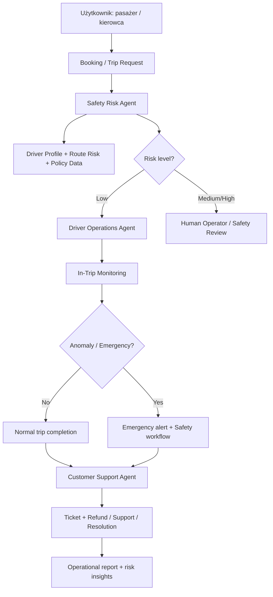

# Rozwiązanie wieloagentowe dla platformy przewozów na aplikację (Uber-like)

## 1. Problem biznesowy

Platforma przewozów na żądanie musi jednocześnie zapewniać:

- bezpieczeństwo pasażerów i kierowców,
- wysoką jakość doświadczenia użytkownika,
- efektywne działanie operacyjne,
- zgodność z politykami i lokalnymi regulacjami,
- szybkie reagowanie na wypadki, nieprawidłowe zachowania i anomalie w trasie.

W praktyce problemy nie pojawiają się tylko w etapie rezerwacji. Ryzyko pojawia się w każdej fazie: od dopasowania kierowcy do przejazdu, przez kontrolę bezpieczeństwa w czasie jazdy, aż do obsługi reklamacji, zgłoszeń, refundacji i analizy zdarzeń po przejeździe.

Tradycyjne, jednosystemowe podejście do obsługi takich scenariuszy jest niewystarczające, ponieważ wymagane są równocześnie:

- analiza danych w czasie rzeczywistym,
- decyzje o bezpieczeństwie,
- obsługa klienta,
- podejmowanie działań operacyjnych,
- wykrywanie anomalii i ryzyka oszustw.

Dlatego w rozwiązaniu proponuję architekturę wieloagentową: każdy agent odpowiada za inny obszar, ale wspólnie tworzą system bezpieczeństwa i operacji dla całej platformy.

---

## 2. Docelowi użytkownicy rozwiązania

Rozwiązanie jest przeznaczone dla:

1. Pasażerów
   - chcących bezpiecznie i przewidywalnie dojechać do celu,
   - potrzebujących szybkiej pomocy w razie problemu,
   - oczekujących jasnego statusu przejazdu i komunikacji.

2. Kierowców
   - potrzebujących wsparcia w zakresie bezpieczeństwa i komunikacji,
   - chcących uniknąć konfliktów i nieprawidłowych zgłoszeń,
   - wymagających pomocy operacyjnej w sytuacji alarmowej.

3. Operatorów / zespołów obsługi klienta
   - monitorujących zdarzenia i ryzyka,
   - podejmujących decyzje o eskalacji lub interwencji,
   - analizujących wzorce nieprawidłowych zachowań i podejrzanych przejazdów.

4. Menedżerów platformy
   - odpowiedzialnych za zgodność, bezpieczeństwo, jakość obsługi oraz KPI operacyjne.

---

## 3. Proponowane rozwiązanie: wieloagentowy system AI

### 3.1 Architektura rozwiązania

System składa się z 3 głównych agentów i kilku narzędzi wspierających:

- Agent bezpieczeństwa i oceny ryzyka
- Agent operacji kierowcy i przejazdu
- Agent obsługi klienta i eskalacji

Dodatkowo system korzysta z baz wiedzy, danych i integracji z systemami zewnętrznymi.

### 3.2 Agent 1: Safety Risk & Trip Assessment Agent

Rola:
- analizuje ryzyko przejazdu przed rozpoczęciem trasy,
- ocenia bezpieczeństwo kierowcy i pasażera,
- wykrywa anomalie w trasie,
- identyfikuje scenariusze wymagające interwencji lub wstrzymania przejazdu.

Dane i narzędzia:
- dane o kierowcy: historia przejazdów, oceny pasażerów, bezpieczeństwo, aktywność, czasy pracy, nieprawidłowe zgłoszenia,
- dane o pasażerze: historię zgłoszeń, oceny, status płatności, profile bezpieczeństwa,
- dane geolokalizacyjne i mapy: trasa, odległość, strefy o wysokim ryzyku, warunki miejskie,
- źródła wiedzy: polityki bezpieczeństwa, zasady bezpieczeństwa firmy, procedury alarmowe,
- narzędzia: `check_risk_profile()`, `lookup_route_risk()`, `detect_suspicious_behavior()`, `verify_driver_status()`.

Przykładowe decyzje:
- kierowca po długim czasie pracy i niskiej jakości oceny → wymaga dodatkowej weryfikacji,
- różnica między trasą a typowym profilem przejazdu → ostrzeżenie o potencjalnym oszustwie,
- pytanie o lokalizację i bezpieczne miejsce odbioru → eskalacja do obsługi.

### 3.3 Agent 2: Driver Operations & In-Trip Monitoring Agent

Rola:
- monitoruje przebieg przejazdu w czasie rzeczywistym,
- porównuje trasę i tempo jazdy z normalnym scenariuszem,
- wykrywa anomalie: gwałtowne zmiany, długie przestoje, zbyt duże odchylenia od trasy, potencjalne zagrożenia,
- wspiera kierowcę lub operatora w czasie zdarzenia.

Dane i narzędzia:
- dane z GPS i telemetrii,
- dane o prędkości, czasie przejazdu, rewizji trasy, statusie kontaktu,
- API komunikacji SOS / alarmu,
- historia utrudnień i zdarzeń z poprzednich kursów,
- baza wiedzy: procedury bezpieczeństwa kierowcy, instrukcje wsparcia w sytuacjach alarmowych,
- narzędzia: `get_live_trip_data()`, `detect_route_deviation()`, `check_driver_rest_time()`, `send_safety_alert()`.

Przykładowe decyzje:
- przejazd niepokrywający się z trasą lub nieuzasadnione przestoje,
- kierowca nie odpowiada na zgłoszenia i nie potwierdza statusu,
- pasażer zgłasza niepokojące zachowanie → szybsza eskalacja.

### 3.4 Agent 3: Customer Support & Incident Resolution Agent

Rola:
- odpowiada za obsługę klienta po zdarzeniu lub w trakcie problemów z przejazdem,
- pomaga w zgłoszeniach, opłatach, opóźnieniach, błędnych lokalizacjach, problemach z kierowcą, refundacjach,
- przygotowuje rekomendacje i komunikaty dla użytkownika lub zespołu obsługi.

Dane i narzędzia:
- historia zgłoszeń i ticketów,
- policy refundowe i zasady obsługi klienta,
- dane map i lokalizacji,
- rejestr zdarzeń i decyzji operacyjnych,
- narzędzia: `lookup_trip_history()`, `create_support_ticket()`, `generate_refund_decision()`, `fetch_policy()`, `summarize_incident()`.

Przykładowe decyzje:
- pasażer zgłasza „złe zachowanie kierowcy” → wywołanie procesu weryfikacji i zapis zdarzenia,
- opóźnienie przejazdu > 15 minut → automatyczna oferta pomocy lub rekompensata,
- niespójność w historii przejazdu → prośba o dodatkowe potwierdzenie.

---

## 4. Dlaczego podejście wieloagentowe jest lepsze niż jednoagentowe

Rozwiązanie jednoagentowe byłoby zbyt ogólne i zbyt podatne na błędy w środowisku produkcyjnym. W przypadku platformy przewozów każda decyzja musi uwzględniać różne typy danych i kontekstów:

- bezpieczeństwo vs. operacje vs. obsługa klienta to trzy różne typy decyzji,
- model ogólny może pomieszać priorytety i zbyt szybko wydawać rekomendacje,
- w krytycznych zdarzeniach wymagane jest szybkie działanie z jasno zdefiniowanymi zakresami odpowiedzialności,
- każda klasyfikacja powinna być oparta na danych i źródłach wiedzy, a nie na przypuszczeniach modelu.

Wieloagentowość zapewnia:

- specjalizację agentów pod konkretne zadanie,
- lepsze uzasadnienie decyzji i łatwiejsze debugowanie,
- łatwiejszy monitoring i ocenę jakości,
- możliwość wdrożenia reguł bezpieczeństwa i eskalacji,
- lepszą skalowalność w produkcji.

---

## 5. Przepływ informacji między agentami

```
Pasażer / Kierowca / System
        |
        v
Trip Request / Booking
        |
        v
Safety Risk Agent
  - ocenia ryzyko przejazdu
  - sprawdza profile kierowcy/pasażera
  - analizuje trasę, warunki i historię
        |
        +--> jeśli ryzyko wysokie: eskalacja do operatora / weryfikacja manualna
        |
        +--> jeśli ryzyko niskie: przekazanie do agentów operacyjnych

        v
Driver Operations Agent
  - monitoruje przebieg przejazdu
  - sprawdza anomalie i warunki bezpieczeństwa
  - potrafi wysłać alarm lub powiadomienie
        |
        +--> jeśli zdarzenie alarmowe: aktywacja procedur bezpieczeństwa
        |
        +--> jeśli wszystko OK: normalna obsługa przejazdu

        v
Customer Support Agent
  - obsługa zgłoszeń, reklamacji, refundacji, komunikacji z użytkownikiem
  - tworzy ticket i podsumowanie zdarzenia
        |
        v
Raport bezpieczeństwa i decyzja biznesowa
```

---

## 6. Plan gotowości produkcyjnej

### 6.1 Strategia obserwowalności

W produkcji kluczowe jest nie tylko to, czy agent odpowiada, ale też jak, kiedy i na podstawie czego podejmuje decyzje.

Dlatego wprowadziłbym następujące ślady i metryki:

- pełne trace każdego wywołania agenta: prompt, dane wejściowe, wywołania narzędzi, odpowiedzi modelu,
- metryki czasu odpowiedzi (latency), kosztów tokenów, liczby wywołań narzędzi,
- logi ryzyka: poziom ryzyka, kategoria zagrożenia, decyzja o eskalacji,
- logi zdarzeń bezpieczeństwa: alarm, opóźnienie, wyjście z trasy, nieuzasadniona zmiana lokalizacji,
- metryki jakości obsługi: czas reakcji supportu, odsetek reklamacji, liczbę eskalacji manualnych,
- dashboard operatora: przejazdy „wymagające uwagi”, alarmy, wzorce dziwnych zachowań.

Dzięki temu można szybko diagnozować:

- czy agent używał właściwych narzędzi,
- czy decyzje były oparte na danych rzeczywistych,
- czy długi czas odpowiedzi powoduje błędne eskalacje,
- czy w jednym typie zdarzeń agent jest zbyt agresywny lub zbyt konserwatywny.

### 6.2 Strategia ewaluacji

Dla tego typu systemu nie wystarczy sprawdzać jeden przypadek „na oko”. Warto zbudować zbiór danych ewaluacyjnych obejmujący różne scenariusze:

- bezpieczny przejazd,
- opóźnienie przejazdu,
- podejrzana trasa,
- kierowca nie odpowiada,
- pasażer zgłasza niepokojące zachowanie,
- wypadek lub zagrożenie bezpieczeństwa,
- spór o cenę lub trasę,
- problem z lokalizacją lub odbiorem.

Kryteria oceny:

- poprawność decyzji i trafność klasyfikacji,
- zgodność z polityką bezpieczeństwa i regulacjami,
- używanie właściwych narzędzi,
- jakość i spójność odpowiedzi,
- bezpieczeństwo i brak nieuzasadnionych działań operacyjnych,
- zdolność do odwoływania się do źródeł wiedzy i policy.

Integracja z cyklem rozwoju:

- testy przed wdrożeniem,
- automatyczne uruchamianie zestawów testowych po zmianie promptów lub modeli,
- porównywanie wersji agentów,
- blokowanie wdrożenia, jeśli jakość spadnie poniżej ustalonego progu.

### 6.3 Zarządzanie, niezawodność i bezpieczeństwo

Aby system był godny zaufania, należy zastosować następujące mechanizmy:

- wersjonowanie promptów i modeli,
- ograniczenie narzędzi do ustalonego zestawu,
- polityki bezpieczeństwa i ograniczenia działania w trybie alarmowym,
- warstwy kontroli: w przypadku wysokiego ryzyka agent nie podejmuje decyzji samodzielnie, tylko eskaluje do operatora,
- odwoływanie się do bazy wiedzy i polityki firmy zamiast do ogólnej wiedzy modelu,
- maskowanie danych wrażliwych (PII),
- audyt wszystkich działań operacyjnych i decyzji.

Narzędzia i baza wiedzy wzmacniają odpowiedzi agentów, ponieważ model nie opiera się wyłącznie na pamięci treningowej, ale na aktualnych politykach, procedurach i danych przedsiębiorstwa.

---

## 7. Kompleksowy workflow rozwiązania

### 7.1 Sekwencja interakcji między agentami

1. Pasażer inicjuje przejazd
2. Safety Risk Agent ocenia profil kierowcy, pasażera i trasę
3. Jeśli poziom ryzyka jest niski: przejazd jest dopuszczony do realizacji
4. Driver Operations Agent monitoruje trasę w czasie rzeczywistym
5. Gdy pojawia się anomalia lub alarm: wysyłane są oznaki bezpieczeństwa i informacje do operatora
6. Customer Support Agent obsługuje zgłoszenia użytkownika i w razie potrzeby przygotowuje rekompensatę lub eskalację
7. Generowany jest końcowy raport bezpieczeństwa i operacji dla menedżerów platformy

### 7.2 Informacje przekazywane między agentami

- dane o przejeździe i profilu użytkownika,
- status bezpieczeństwa i poziom ryzyka,
- sygnały geolokacyjne i telemetryczne,
- informacje o zdarzeniu i decyzji operacyjnej,
- podsumowanie zdarzenia dla obsługi klienta i zarządzania.

### 7.3 Narzędzia i pobieranie wiedzy

- `lookup_driver_profile()`
- `check_route_risk()`
- `detect_trip_anomaly()`
- `fetch_policy_documents()`
- `get_trip_history()`
- `create_support_ticket()`
- `send_emergency_notification()`

### 7.4 Końcowy wynik

System dostarcza:

- bezpieczny przejazd lub blokadę ryzykownego scenariusza,
- wykrycie nieprawidłowości w trakcie przejazdu,
- natychmiastową obsługę klienta i operatora,
- raport bezpieczeństwa i podsumowanie operacyjne dla menedżerów.

### 7.5 Wdrożenie, monitoring i ulepszanie

Rozwiązanie można wdrożyć jako:

- zapleczone agenty w Microsoft Foundry,
- workflow orchestracji między agentami,
- API do integracji z aplikacją mobilną, systemem obsługi klienta i dashboardami operacyjnymi.

Po wdrożeniu system jest monitorowany, ewaluowany i poprawiany na podstawie danych z rzeczywistych przejazdów, zgłoszeń i statystyk bezpieczeństwa.

---

## 8. Diagram architektury



---

## 9. Dlaczego to rozwiązanie ma sens biznesowo

To rozwiązanie odpowiada realnemu problemowi platformy typu Uber:

- bezpieczeństwo jest priorytetem,
- całe środowisko jest dynamiczne i wymagające czasu rzeczywistego,
- decyzje muszą być oparte na danych, nie tylko na intuicji,
- obsługa klienta, kierowców i operacji musi działać jako jedna spójna ekosystemowa logika,
- system musi być nie tylko „inteligentny”, ale też bezpieczny, monitorowalny i gotowy do wdrożenia w produkcji.

W praktyce takie rozwiązanie nie tylko poprawia bezpieczeństwo, ale też zmniejsza koszty obsługi, zwiększa zaufanie użytkowników i pozwala firmie lepiej skalować operacje.

---

## 10. Krótka prezentacja do zaprezentowania (3–5 minut)

### Temat
Wieloagentowy system AI do bezpieczniejszej i bardziej operacyjnie efektywnej platformy przewozów na żądanie.

### Struktura prezentacji

1. Wprowadzenie do problemu
   - platforma typu Uber ma trzy główne ryzyka: bezpieczeństwo, operacje i obsługa klienta,
   - pojedynczy model nie radzi sobie z równoczesnym monitorowaniem tych obszarów.

2. Architektura rozwiązania
   - Safety Risk Agent,
   - Driver Operations Agent,
   - Customer Support Agent.

3. Korzyści z wieloagentowości
   - rozdzielenie odpowiedzialności,
   - lepsza weryfikacja i szybkość reakcji,
   - łatwiejsze monitoring i debugowanie,
   - lepsza gotowość produkcyjna.

4. Produkcyjna gotowość
   - trace i monitorowanie,
   - ocena jakości według zestawu scenariuszy testowych,
   - ręczna eskalacja w przypadku wysokiego ryzyka,
   - baza wiedzy i polityki bezpieczeństwa.

5. Podsumowanie
   - rozwiązanie jest nie tylko „demo AI”, ale gotowym do wdrożenia systemem wspierającym realne procesy biznesowe.

---

## 11. Wnioski końcowe

Rozwiązanie wykorzystuje te same wzorce, które zostały omówione w kursie:

- specjalistyczni agenci,
- narzędzia i źródła wiedzy,
- monitoring i śledzenie zachowania,
- ewaluacja i metryki jakości,
- workflow wieloagentowy w środowisku produkcyjnym.

To pozwala przejść od prototypu do rozwiązania, które jest zorientowane na biznes, gotowe do wdrożenia i zbudowane z myślą o bezpieczeństwie użytkowników oraz kierowców.
